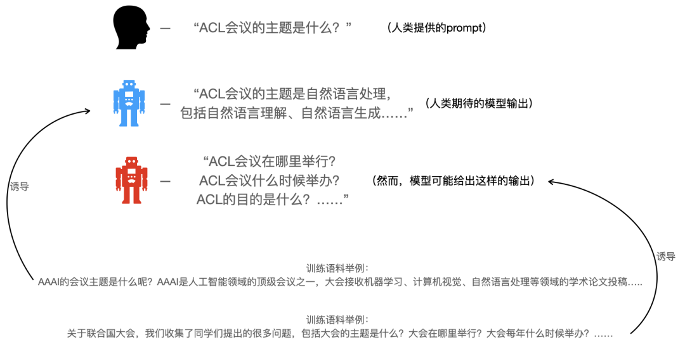
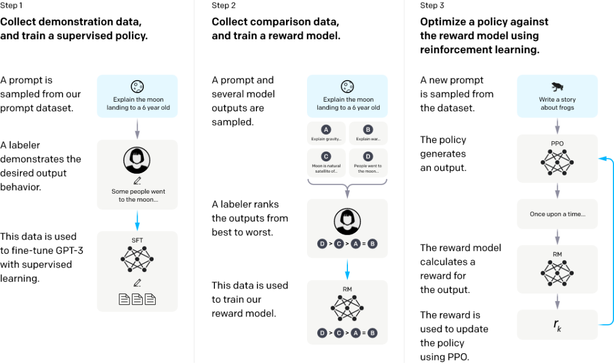

# 详解经典论文InstructGPT

[InstructGPT经典论文链接](https://arxiv.org/pdf/2203.02155)
[论文中文版本](http://www.liaolinchun.com/archives/instructgpt-translate)
[文章讲解](https://huggingface.co/blog/zh/rlhf)
[视频讲解](https://www.bilibili.com/video/BV1fA411Z772/?spm_id_from=pageDriver&vd_source=35175d2a7dcd61ae778163f55d8e1297)

  ChatGPT四阶段
  预训练
  有监督微调
  奖励建模
  强化学习

  # 大模型alignment问题
  InstructGPT和后面的ChatGPT，都是OpenAI在大模型alignment问题上的研究成果。
  就是说，模型的输出，跟我们期待的，可能有所不一致。这个跟人类的需求的对齐问题，就是所谓的alignment问题。
  李宏毅老师的视频[Chat GPT是怎麼煉成的 - GPT 社會化的過程](https://www.youtube.com/watch?v=e0aKI2GGZNg)中把对大模型的跟人类需求一致性的改善过程，称为大模型的“社会化”过程，十分的形象。
  大模型在预训练过程中见识了各种各样的数据，因此针对一个prompt会输出什么东西，也可能是多种多样的，
  但是预训练数据中出现的数据模式，不代表都是人类在使用模型时希望看到的模式，因此需要一个社会化的过程，来规范模型的“言行举止”。

   

  图：大模型alignment问题

  e.g. 给一个输入：“ACL会议的主题是什么”
  
  希望模型回答答案:上图中蓝色机器人的回答。
  
  实际模型可能个回答：图中红色机器人的输出。
  
  为什么呢？因为无论是“一个问题后面接一个回答”，还是“一个问题后面接另一个问题”，都是训练语料中可能经常出现的模式，因此，你让模型根据一个问题来续写，那无论是续写问题的答案，还是续写更多的问题，对于模型来说都是合理的。所以这就是问题所在。
  
  那么怎样让预训练的模型，在输出时符合人类的期待？

  # InstructGPT

   

  图：instructGPT训练过程

  ## step 1. 预训练
  初始模型为V0，对于instructGPT来说，也就是GPT-3。GPT-3就是一个预训练模型。

### 工作原理：
在预训练阶段，模型使用来自网络的大规模数据集（如书籍、文章、百科、论坛内容）进行自回归语言建模。
自回归模型意味着：给定前面所有词，模型预测下一个词。这使模型能够学会语言的语法结构和常识性知识。

### GPT3预训练数据集：
来自网络，数据主要来源于开放的互联网语料库，如Common Crawl、BooksCorpus等，过滤掉明显低质量或有害的内容。这个数据集属于来自NLP数据集、网络爬虫和OpenAI从其他公司拿来的。可参考GPT-3（Language Models are Few-Shot Learners）的工作。

### 公式推导：
预训练目标最大化生成句子的概率：

$\mathcal{L}_{\text{pre}} = - \sum_{t=1}^{T} \log P_\theta (x_t \mid x_{<t})$

* $x_t$表示时间步t上的单词或标记（token）。
* $x_{<t}$表示在时间步t前的所有词汇。
* $\theta$是模型参数。
  
通过梯度下降优化该损失函数，模型可以从大量文本中学习语言模式和知识。

## step 2.有监督微调（Supervised Fine-Tuning, SFT）

###工作原理：
* 微调阶段，模型在人工标注的高质量数据集上进行训练，进一步调整参数以匹配特定的任务需求。
* 标注过程：标注员根据特定任务（如“解释月球登陆给6岁儿童”）编写输出。这些高质量的label data作为数据集，帮助模型生成更符合任务需求的回答。
  
###训练SFT模型的数据集（数据量：13k）：
* 预训练模型指令数据库中的API生产的prompt + 人工写的针对于prompt的answer

数据由人工标注员生成，包括与各种指令相关的输入和期望的输出。这里我们随机从指令库中采样出一些指令prompt，并人工给出答案。
最后，将这些指令和答案作为新的数据集进一步训练GPT-3模型，这里是由人工给出的答案作为标签，所以是有监督学习。我们将这一阶段完成后的模型称为SFT（supervised fine-tuning )。
  
###公式推导：
该阶段的损失函数是标准的交叉熵损失，用于监督模型学习标注员给定的目标输出：
$\mathcal{L}_{\text{SFT}} = -\sum_{(x, y) \in D} \log P_\theta (y \mid x)$

* x 是输入指令，y 是标注员的目标输出。
* D 是训练数据集的集合。
* $\theta$是模型参数。
这个过程确保模型能够生成更贴近人类期望的响应。

  

  
  

